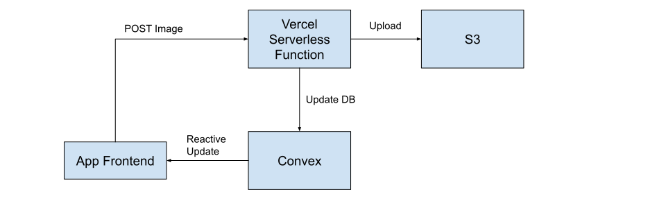
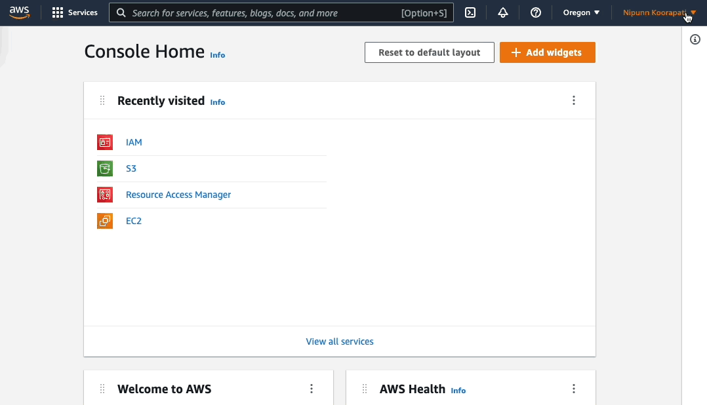

# S3 Photo Upload Example App

Adding file storage and uploads to Convex apps is easy to do using
[Convex file storage](https://docs.convex.dev/using/file-storage).

However, if you choose, you can instead integrate with
[Amazon Web Services (AWS) S3](https://aws.amazon.com/s3/). Here is an example
of how to implement image uploads using S3 and [Vercel](https://vercel.com/).

This app uses [Vercel](https://vercel.com) to host API endpoints that upload and
download the files from S3.



## Create an S3 Bucket

If you already have an existing S3 bucket configured, you can skip this step.

[Create a bucket](https://s3.console.aws.amazon.com/s3/bucket/create) via the
AWS S3 console. Choose a bucket name and region. Default settings will work for
this guide.


## Set up your AWS credentials

Create credentials. Do not share them publicly.


For development, create a `.env` file which we will use later. For secrecy, do
not check it into git.

```
BUCKET_NAME='your-bucket-name'
ACCESS_KEY='your-aws-access-key'
SECRET_KEY='your-aws-secret-key'
```

For deployment, you can follow vercel's
[environment variables guide](https://vercel.com/docs/concepts/projects/environment-variables).

## Implement your API functions

Using
[Vercel Serverless Functions](https://vercel.com/docs/concepts/functions/serverless-functions),
add some API methods. See
[External Functions](/using/integrations/external-functions) for more about
using external functions with Convex. See
[upload-image.js](./api/upload-image.js) and
[get-image](./api/get-image/[key].js) for examples.

## Call your file storage API methods

Add a form for image submission. Upload to S3 when the form is submitted. Get
from S3 when such a message is queried.

See [App.jsx](./src/App.jsx) for an example.

## Running the App

Run:

```
npm install
npm run dev
```

The Vercel CLI will prompt you about how to configure the project. Use the
auto-detected [Vite](https://vitejs.dev/) settings.
